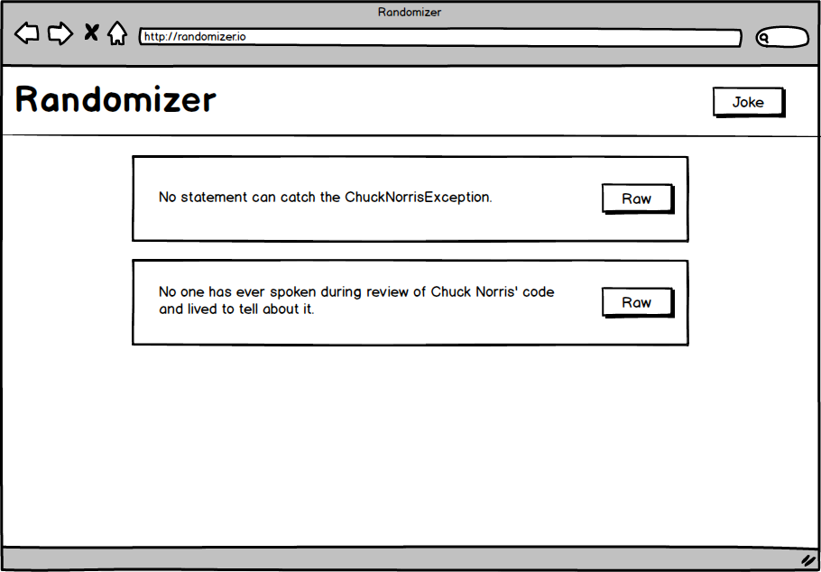

# Randomizer

Simple frontend application that demonstrates how TEA works.
It gets random jokes from the Chuck Norris database.



### Install:
Clone this repo:
```
git clone https://github.com/jovannypcg/elmseed.git randomizer
cd randomizer
```

Install all dependencies using the handy `reinstall` script:
```
npm run reinstall
```
*This does a clean (re)install of all npm and elm packages, plus a global elm install.*


### Serve locally:
```
npm start
```
* Access app at `http://localhost:8080/`
* Get coding! The entry point file is `src/elm/Main.elm`
* Browser will refresh automatically on any file changes..


### Build & bundle for prod:
```
npm run build
```

* Files are saved into the `/dist` folder
* To check it, open `dist/index.html`
